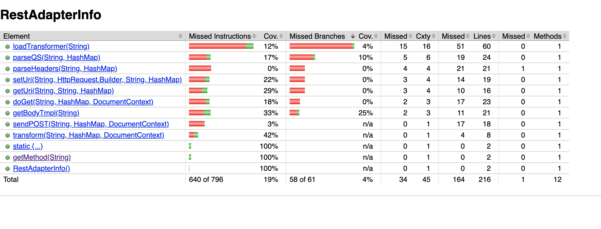
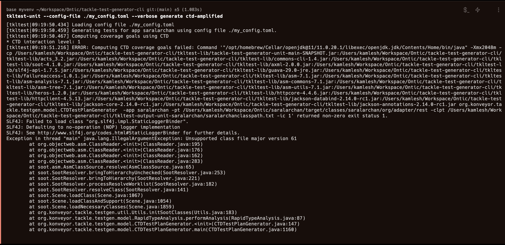
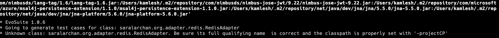

# OVERVIEW

We have already set a base ground for generating unit tests for Java
codebases using LLMs. We not plan to evaluate some non LLM based unit
test generators to figure out the workings and do comparisons

# GOALS

1. Experiment to understand the efficiency of non LLM unit test
   generators.
2. Understand the internal workings of these tools

# SPECIFICATIONS

The tools figured so far that we plan to cover

## Open Source

### Randoop

For the 100 unit test limit, we ran it on RestAdapterInfo.java

- It generated 66 regression tests & 34 error tests
- For our use-case only the regression tests work.
- Manual Fixes

  - It uses Junit 4 methods for assertions & method ordering.
    This needs manual changes if the project uses Junit 5, which is the case for our codebase. So all assertion methods need to be manually changed.
  - No way to configure this, there are mentions of the Junit version
    being picked up from classpath, which in our case says explicitly
    that its 5, still the generator uses version 4.
  - Class names include an integer by default, because the setup is the
    0th file will include all the generated files and run those. If we
    want a more standard testing setup, the class names need to be
    updated manually.
  - Test function names are like "test58()" and they increase serially.
    No way found to have more meaningful names. We did think of one way
    where we can combine this with an LLM and ask it to rename, this
    will work in itself.
  - In the final file with 66 regression tests there were 6 assertion
    failures, so we had to Disable these to generate the coverage
    report

- We can configure limits like

  - Number of files
  - Package name
  - Test File name
  - Number of tests generated
  - [Number of tests in one file
  - No error or no regression tests
  - Percentage of cases where null attributes are passed

- The eventual coverage with 60 tests running(66 - 6 disabled) was 19% & 4%(branches) which is not good.



#### Possible next steps

- We can try generating a bigger number like 10000 tests, but to make it runnable we will have to write another script to make all
  those manual changes and then see how the coverage looks like. Then
  we can write a script to extract unique test cases from the original
  generation. One basic idea of uniqueness can be, method call +
  assertion. Still, other issues like test method names would still
  remain.
- There is a way to specify replacement classes. So this can be used
  to mock external calls. But to generate these replacement classes we
  will have to use a LLM.

#### How To Run

Pre-requisites

- Java 17

Steps

- Download and unzip the file [randoop-4.3.2.zip](https://github.com/randoop/randoop/releases/download/v4.3.2/randoop-4.3.2.zip).
- Get your class path by running the following command in the root of
  the project

  ```
  mvn dependency:build-classpath
  ```

- Copy the classpath and append the path to the jar file of randoop that we downloaded in step 1. Something like below. Here the downloaded jar is in the Downloads folder.
  ```
  .../Users/akashdeepsingh/.m2/repository/net/java/dev/jna/jna/5.5.0/jna-5.5.0.jar:/Users/akashdeepsingh/.m2/repository/net/java/dev/jna/jna-platform/5.6.0/jna-platform-5.6.0.jar:/Users/akashdeepsingh/Downloads/randoop-4.3.2/randoop-all-4.3.2.jar:
  ```
- Export the classpath as an environment variable. Something like below

  ```
  export CLASSPATH=...
  ```

- Then in the root directory of the project run the following command
```
java randoop.main.Main gentests --testclass=saralarchan.org.adapter.rest.RestAdapterInfo --time-limit=120 --junit-package-name='saralarchan.org.adapter.rest' --regression-test-basename=RestAdapterInfoTest --junit-output-dir=src/test/java/saralarchan/org/adapter/rest/ --output-limit=100 --generated-limit=100 --flaky-test-behavior=DISCARD --testsperfile=100
```

- This command will generate tests in Junit4 and also it has a specific format in which it will generate the files. So we need to make some changes to the generated files to make it work with Junit5. There is sample file [here](RestAdapterInfoTest.java) which has the changes that we made to make it work with Junit5.

- You can play around with different parameters above. You can find the details of the parameters [here](https://randoop.github.io/randoop/manual/index.html)

### Tackle Test

#### Learnings

- The original jar and setup instruction do not work as
  expected.
- We figured that the codebase was using some deprecated dependencies
  which were not allowed
- We manually changed the version of PyYaml to 6.0.1 in setup.py to
  make it run
- It supports Java 8-11 only.
- It support python version till 3.9
- Even after compilation errors were resolved, we could not make it
  run
- It expects compiles classes for java version 55 only
- Even when we compiled the code in java 55, which is java 11, still
  the issue could not be resolved.



### Evosuite - Ongoing

- It supports only Java 8.
- Comes with a ready to use jar file which can be run with two
  arguments i.e. target classes and the project classpath.
- Generates a separate scaffolding file for each test class that
  consists of \@Before and \@After methods to ensure tests are always
  executed in the same consistent state.
- Provides a coverage report of the tests generated.
- We need to use evosuite-standalone-runtime-1.0.6.jar file to run
  the generated tests.
- The test classes will be executed with the EvoRunner, rather than a
  default JUnit runner. This will need
  evosuite-standalone-runtime-1.0.6.jar.
- Command run

<pre>
java -jar evosuite.jar -class saralarchan.org.adapter.redis.RedisAdapter -projectCP `classpath`
</pre>



## Closed Source

### Vizitest
